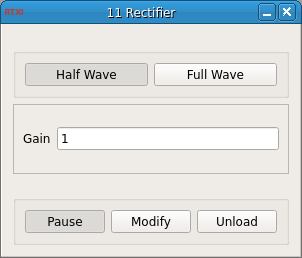

### Rectifier

**Requirements:** none
**Limitations:** none

<!--start-->

<b>Rectifier:</b> QWhatsThis description.

<!--end-->

#### Input
1. input(0) - Signal In : Signal to rectify

#### Output
1. output(0) - Signal Out : Rectified signal

#### Parameters
1. Gain - Optional gain of rectified output

#### States

